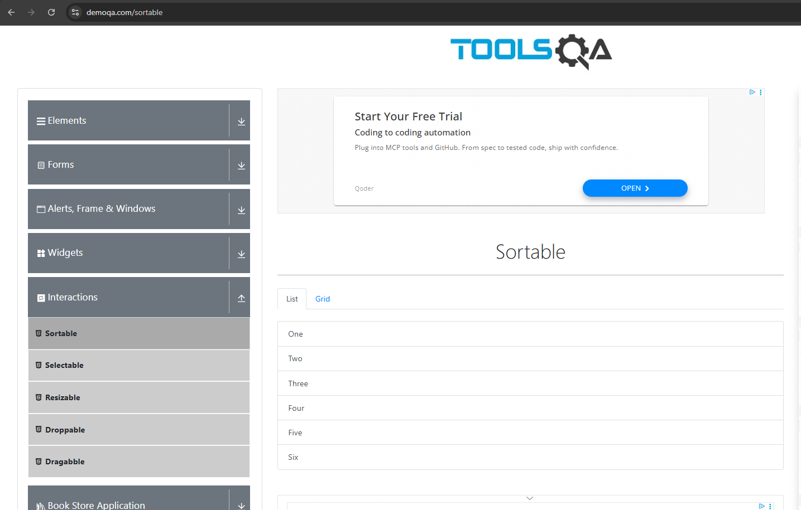

# DemoQA Sortable – Lista já carregada em ordem crescente

Resumo
- Em alguns momentos, a página pública https://demoqa.com/sortable carrega a aba "List" já com os itens na ordem crescente (One, Two, Three, Four, Five, Six).
- Isso reduz o valor do teste end-to-end de ordenação, pois não há trabalho de rearranjo quando a ordem já está correta.

Impacto
- O cenário de teste que valida o drag-and-drop perde significado quando iniciado já ordenado.
- Pode mascarar problemas de interação/drag caso o teste não force uma reordenação.

Cenário observado
- Ambiente público, não controlado, intermitente. Ordem inicial pode variar entre execuções e horários.

Como reproduzir
1) Acessar https://demoqa.com/sortable
2) Garantir que a aba "List" esteja ativa
3) Observar que, em certas execuções, os itens já estão em ordem crescente por padrão

Workaround adotado no projeto
- Implementado `shuffleList()` no POM `SortablePage` para realizar 2–3 movimentos determinísticos (ex.: Six → 0, Four → 2, Two → 4), garantindo que a lista fique fora de ordem antes de ordenar.
- Em seguida, o teste executa `sortListAscending()` para validar a ordenação do menor para o maior.

Evidências
- Screenshot (lista já ordenada ao carregar):

  

- Vídeo de evidência (carregamento já ordenado):

  [Abrir vídeo](./evidencia.mp4)

  <!-- Fallback com embed opcional para visualização direta em Markdown renderers que suportam HTML -->
  <video src="./evidencia.mp4" controls width="640">
    Seu navegador não suporta a tag de vídeo. Baixe o arquivo acima.
  </video>

Sugestões
- Para propósitos de avaliação/estabilidade, considerar:
  - Introduzir uma etapa de embaralhamento sempre que a ordem inicial já estiver correta
  - (Opcional) Validar também a aba "Grid" com lógica similar
  - Abrir um issue upstream (caso aplicável) descrevendo a variação do estado inicial da página pública

Notas
- Por ser um ambiente público de demonstração, variações de conteúdo e comportamento são esperadas. O workaround preserva o propósito do teste sem acoplar ao estado inicial.
